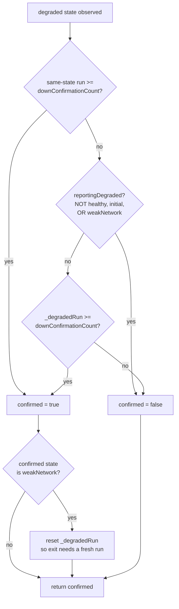

# Confirmation-Gate Fix - Plan

**Target repo:** `neo_connection_health`

---

## Status

**Implementation-ready.** Revised 2026-07-20 after a five-persona document review. Two prior adversarial reviews had already rejected the original U2 damping design.

Two units left this plan:

- **U2 (instability damping) is retired.** It suppressed flicker by masking flips, but a recovery *is* a flip, so it masked recoveries too. Preserved in Retired Work.
- **U1 (the trigger seam) moved to a follow-up milestone** alongside the `../neo` wiring that is its only consumer. It delivered nothing on its own, and freezing its constants into a released API before any real event stream had exercised them was the larger risk. See Follow-Up Milestone.

What remains is the confirmation-gate bug fix, its documentation, and the release.

Unit and requirement IDs are never renumbered. **U0** is the code unit; **U3** and **U4** are documentation and release. U1 is relocated, U2 retired in place. R6–R10 are retired; R1–R5, R12 and R16 relocated with U1.

---

## Goal Capsule

**Objective.** Fix a confirmation-gate bug that strands the user on a reassuring "weak network" banner while their device is fully offline, with no path to self-correct. Ship the documentation that goes with it, including one adjacent consumer recipe (R11) for a connect-phase timeout.

**No user is affected by any part of this plan until the consumer app adopts the package.** `neo_connection_health` appears on no pushed branch of `../neo` — not `main`, not `dev`, not `master`. The only reference is a `pubspec.yaml` on the local, unpushed `feat/health-monitor-wiring` branch. That branch landing is a predecessor to any user-visible outcome here (see Sequencing). The bug U0 fixes is real and reachable, and it will bite the moment the app ships; it is not biting anyone today.

**Authority hierarchy.** `CLAUDE.md` §4 (server-first ordering) and §Tech (pure Dart, no Flutter dependency) outrank this plan. Where this plan and the repo's existing conventions disagree, the conventions win. The uncommitted work in the tree is the baseline — plan on top of it, do not revert it.

**Stop conditions.** Stop and surface rather than guessing if: a change would touch `_runCheck()`'s server-first order, or an existing test fails in a way that looks like a real behavioral conflict rather than an expected update.

**Execution profile.** Behavior-first. U0 changes emitted behavior and carries all the test scenarios; U3 and U4 are documentation and release notes.

**Tail ownership.** Feature branch (`feat/weak-network-state`, already checked out), one PR to `master`.

---

## Product Contract

### Summary

Fix the `_isConfirmed` predicate that lets `weakNetwork` disarm the gate's generic-failure rule, stranding the user on a false-reassuring banner. Correct the documentation the fix falsifies. Ship the connect-phase timeout as a consumer recipe, since it lives in the consumer's composition root.

### Problem Frame

**The gate locks open.** `_isConfirmed` gates a degraded probe result behind two rules: rule 1 is `downConfirmationCount` observations of the *same* state; rule 2 is `downConfirmationCount` consecutive failures of *any* kind, but only while nothing degraded is on screen yet. Rule 2 exists to stop a link alternating between two failure modes from reporting nothing forever. Its guard:

```dart
final reportingDegraded = _currentState != ConnectionHealthState.healthy &&
    _currentState != ConnectionHealthState.initial;
```

`weakNetwork` is neither `healthy` nor `initial`, so it satisfies the predicate and disarms rule 2. But `weakNetwork` is a *successful* probe — the server answered, just slowly. It sits in the enum among the failure states and semantically belongs with `healthy`. The predicate reads correct and is not.

The trap, at `downConfirmationCount: 2` (which the consumer app ships): a slow-but-successful probe lands you in `weakNetwork`; the link then degrades into *alternating* `internetDisconnected` / `serverUnreachable`, which is what an unstable corporate or tier-2 link actually produces. Rule 1 never fires — no state twice in a row. Rule 2 never fires — disarmed. **Nothing can ever confirm.** The user holds *"Weak Network — Neo 1 is still capturing. Your memory will sync once the connection improves"* on a fully offline device, indefinitely. That copy is reassuring, which makes it worse than showing nothing.

This is the exact never-confirms trap rule 2 was written to close, re-entered through a state rule 2 does not recognise as an empty banner. It is reachable in the tree today. No test covers it: the suite reaches `weakNetwork` only from a stable slow link, never from one that subsequently degrades.

**An adjacent problem, cheap to document alongside.** In a network black hole the radio stays registered while packets vanish, so the probe burns the full 8-second `requestTimeout` before the tiebreaker even starts. Worst case from tick to emitted state is roughly 11 seconds. The remedy is a consumer-side injection, not package code — see KTD10 and R11.

### Requirements

**Confirmation gate**

R14. `weakNetwork` no longer counts as "something degraded is on screen" for the purpose of the gate's second rule, so a link that degrades out of `weakNetwork` into alternating failure modes can still confirm one.
R15. Confirming `weakNetwork` resets `_degradedRun` **on every confirming path**, so leaving `weakNetwork` requires a fresh run of `downConfirmationCount` observations rather than confirming on the next single failure.

**Documentation**

R11. README and dartdoc carry a consumer recipe for a connect-phase timeout injected through the existing `httpClient` parameter, including that the consumer owns the injected client's lifetime and the two cases the timeout does not cover.
R13. `CHANGELOG.md` and `pubspec.yaml` reflect the release per the repo's existing 0.x conventions.

**Relocated to the follow-up milestone.** R1, R2, R3, R4, R5 (trigger), R12 (failure-tick merge), R16 (`connectivity_plus` recipe) — all depend on `triggerStream`.

**Retired.** R6, R7, R8, R9, R10 — the damping requirements. See Retired Work.

### Scope Boundaries

**In scope.** Everything under Requirements above, within `neo_connection_health`.

**Not in scope.**

- The trigger seam. Relocated, not cancelled — see Follow-Up Milestone.
- Instability damping in any form. Retired by decision — see Retired Work.
- `serverUnreachable` copy. The consumer app renders nothing for it today. It is blocked on design capacity rather than engineering, which is why it does not compete with this work; it is tracked in the follow-up milestone.
- The `serverDegraded` body-parse state reserved in `CLAUDE.md` §Out of scope.
- Any change to `_runCheck()`. The server-first order and the tiebreaker's position are correctness guarantees, not tuning targets.
- Package code for the connect-phase timeout. It is a consumer-side injection; the package must not reintroduce `dart:io`.

---

## Planning Contract

### Key Technical Decisions

**KTD9. Rearm the gate's second rule when `weakNetwork` is on screen — both halves, on every confirming path.** Excluding `weakNetwork` from `reportingDegraded` alone opens a *different* hole. `_degradedRun` is cleared only by a `healthy` observation, and confirming `weakNetwork` requires it to already have reached `downConfirmationCount` — so the counter sits at threshold the moment the banner appears. Rearming rule 2 without also resetting `_degradedRun` on that confirmation would let the very next single failure confirm on one observation, defeating the blip protection `downConfirmationCount` exists to provide. The fix is R14 and R15 together; either alone is a regression.

Critically, `_isConfirmed` has **two** confirming exits — rule 1's `return true` and rule 2's compound expression — and `weakNetwork` reaches the state through both. R15 applies to both or it is half-applied. See U0.

**KTD10. The connect-phase timeout is documentation, not package code.** `requestTimeout` stays at 8 seconds. Connect time is round-trip-bound and sub-second even at tier-2 3G latencies; transfer time is bandwidth-bound and is what the 8 seconds protects. Delivering it through the existing `httpClient` seam keeps `dart:io` out of the package, which the in-tree work deliberately removed for Web/WASM capability. Two limitations must be documented, not glossed: DNS resolves before `HttpClient.connectionTimeout` is installed, so a black-holed resolver is caught only by the outer deadline; and `_probeServer` drains the body specifically to keep the pooled connection reusable, so a probe that reuses a warm socket skips the connect phase entirely and the timeout never fires.

**KTD13. Instability is deferred, not solved — and the deferral now has a reachable trigger.** Damping in the specified form is unshippable (Retired Work). The windowed alternative is not obviously wrong, but the case for building it rests on inference: nobody has measured how often an unstable link occurs in the field, or for how long. R14/R15 close the acute bug that made instability *user-visible as a lie*; the remaining behavior is merely imprecise.

The measurement that would reopen this **cannot be read from `stream`**. After U0, an unstable link at `downConfirmationCount: 2` confirms via rule 2, then `reportingDegraded` disarms rule 2 and rule 1 holds one label — so an unstable link and a steady failure are indistinguishable from outside. Raw verdicts exist only inside `_runCheck()`, and the package takes no logging by standing decision.

Its one sanctioned path is an optional `void Function(ConnectionHealthState raw)` probe callback on the constructor, which `CLAUDE.md` §Out of scope already permits ("an optional `void Function(Object)` log callback in a future revision if needed, but no framework dependency"). That callback is the concrete prerequisite for revisiting KTD13. See Risks measurement 3 for owner, date, and default outcome.

**Relocated with U1.** KTD1, KTD2, KTD3, KTD4, KTD11, KTD12 — all trigger-design decisions. Carried to the follow-up milestone with the corrections recorded in Open Questions below.

**Retired.** KTD5, KTD6, KTD7, KTD8 — all damping rationale. See Retired Work.

### High-Level Technical Design

Directional guidance for review, not implementation specification.

**Confirmation gate (U0).** Two edits, both required, and the second applies to every confirming exit.



The single merge point at `confirmed` is the design: it is what makes R15 unconditional across both rules rather than an edit to one return statement.

### Sequencing

U0 lands first, then U3 documents it, then U4 closes the release.

**Predecessor outside this repo.** The `../neo` `feat/health-monitor-wiring` branch must land for any of this to reach a user. It is local and unpushed today. Nothing in this plan blocks on it, and it blocks on nothing here — but the milestone is not delivered until it ships.

---

## Implementation Units

### U0. Fix the confirmation gate's lock-open

**Goal.** A link that degrades out of `weakNetwork` into alternating failure modes can confirm a real failure, without opening a single-observation false-confirm path.

**Requirements.** R14, R15.

**Dependencies.** None.

**Files.**
- `lib/src/connection_health_monitor.dart`
- `test/connection_health_monitor_test.dart`

**Approach.** Two halves in `_isConfirmed`; applying either alone is a regression.

**Half 1 (R14).** Add `weakNetwork` to the `reportingDegraded` exclusion list:

```dart
final reportingDegraded = _currentState != ConnectionHealthState.healthy &&
    _currentState != ConnectionHealthState.initial &&
    _currentState != ConnectionHealthState.weakNetwork;
```

**Half 2 (R15) — restructure to a single exit.** `_isConfirmed` currently confirms from two places: rule 1's bare `return true` and rule 2's compound `return !reportingDegraded && _degradedRun >= downConfirmationCount`. Writing the reset "before returning true" patches one of them and silently leaves the other, because `weakNetwork` reaches the state through both. From `healthy` at `downConfirmationCount: 2`: observe `serverUnreachable` (`_degradedRun=1`, unconfirmed), then a slow 200 → `weakNetwork` (`_degradedRun=2`, `_streakCount=1`, rule 1 fails, rule 2 confirms). A rule-1-only patch leaves `_degradedRun` at threshold, half 1 rearms rule 2, and the next single failure confirms on one observation — the exact bug KTD9 exists to prevent.

Compute both rules into a local, apply the reset once, return it:

```dart
var confirmed = _streakCount >= downConfirmationCount;
if (!confirmed) {
  final reportingDegraded = /* half 1 predicate */;
  confirmed = !reportingDegraded && _degradedRun >= downConfirmationCount;
}
if (confirmed && state == ConnectionHealthState.weakNetwork) _degradedRun = 0;
return confirmed;
```

Update `_isConfirmed`'s dartdoc: the current text states rule 2 switches off "once a degraded state IS on screen", which stops being true for `weakNetwork`. Say why — `weakNetwork` is a successful probe and escalating out of it should be allowed generically. Update the `weakNetwork` enum dartdoc to state it is exempt from `reportingDegraded`.

**Patterns to follow.** `_isConfirmed`'s existing shape as a small predicate over private counters; the counter reset block already at the top of the method for the `healthy` case; the dartdoc density of the existing enum values.

**Test scenarios.**
- **Regression guard:** from an established `weakNetwork` at `downConfirmationCount: 2`, alternating `internetDisconnected` / `serverUnreachable` for several probes eventually emits a failure state. Fails before half 1, passes after.
- **Blip-protection guard (rule-1 route):** from a `weakNetwork` established by two consecutive slow probes at `downConfirmationCount: 2`, a *single* failure does not confirm. Fails if half 2 is omitted.
- **Blip-protection guard (rule-2 route):** from `healthy` at `downConfirmationCount: 2`, observe `serverUnreachable`, then a slow 200 (confirming `weakNetwork` via rule 2), then one `internetDisconnected` — assert nothing is emitted for that single failure. **Fails if half 2 is applied to rule 1 only.** No existing test reaches `weakNetwork` by this route; test 35 uses the rule-1 route.
- From an established `weakNetwork`, two consecutive identical failures still confirm via rule 1 (unchanged path).
- `downConfirmationCount: 1` behaviour is byte-identical — rule 1 fires on the first observation, so rule 2 is never consulted.
- Recovery is never delayed: `healthy` from `weakNetwork` still confirms immediately via the existing bypass.
- **Mutation check:** reverting half 1 fails the regression guard; reverting half 2 fails *both* blip guards; applying half 2 to rule 1 only fails the rule-2-route guard specifically.

**Verification.** All three guards pass; the whole pre-existing suite passes unmodified.

---

### U3. Consumer documentation and doc corrections

**Goal.** The gate's behavior is documented accurately, and the one adjacent consumer recipe is written down where the consumer will find it.

**Requirements.** R11.

**Dependencies.** U0.

**Files.**
- `README.md`
- `CLAUDE.md`
- `lib/src/connection_health_monitor.dart` (dartdoc only)
- `example/neo_connection_health_example.dart`

**Approach.**

**R11 — the connect-phase timeout recipe.** A README section in the shape of the existing `WidgetsBindingObserver` snippet: an `IOClient` wrapping an `HttpClient` with a ~4-second connect timeout, injected through `httpClient`. State four things: it layers under `requestTimeout` rather than replacing it; DNS is not covered; a probe reusing a pooled socket skips the connect phase so the timeout does not fire there either; and the consumer owns an injected client's lifetime because the monitor never closes one it did not create. Decide deliberately whether `example/` demonstrates it — doing so adds a `dart:io` import to `example/`, outside the `lib/`-scoped ban but a choice, not an accident.

**Correct the documentation these changes falsify.**
- `_isConfirmed` dartdoc and the matching README passage both state rule 2 switches off once anything degraded is on screen. No longer true for `weakNetwork`.
- The `weakNetwork` enum dartdoc must state the `reportingDegraded` exemption.
- **`CLAUDE.md` §6 still says `checkNow()` "DOES update `currentState` and reset the scheduled timer."** The 0.2.0 work already in the tree changed this — CHANGELOG 0.2.0 records "`checkNow()` no longer moves `currentState`". Correct §6 to match the shipped behavior.

**Patterns to follow.** The existing README's "Caller responsibility — backgrounding" section: a blockquote requirement, a why paragraph, then a copy-paste snippet with inline comments on the non-obvious lines.

**Test scenarios.** `Test expectation: none — documentation only.` The example must still analyze clean and run, which `tool/check.sh` covers.

**Verification.** `tool/check.sh` passes. No dartdoc or README passage still contradicts `_isConfirmed`. `CLAUDE.md` §6 matches shipped `checkNow()` behavior.

---

### U4. Release notes and version

**Goal.** The release is described accurately.

**Requirements.** R13.

**Dependencies.** U0, U3.

**Files.**
- `CHANGELOG.md`
- `pubspec.yaml`

**Approach.** **Fold into the existing 0.2.0 section rather than cutting a new version.** 0.2.0 is dated in the changelog but has no git tag and was never published, so no consumer holds it and there is nothing to preserve a boundary against. `pubspec.yaml` stays at `0.2.0`. State this reasoning inline, as the existing 0.2.0 entry does for its own version choice.

Add to the existing **Fixed** subsection: the lock-open bug, as its own entry. Name the failure mode it prevents, per the section's existing habit: a user stranded on a reassuring weak-network banner while fully offline, with no path to self-correct. Note it is only observable at `downConfirmationCount >= 2`.

**Also fix the section itself:** 0.2.0 currently has **two separate `### Fixed` headings** (CHANGELOG.md:18 and :29). Merge them into one.

**Test scenarios.** `Test expectation: none — release metadata only.`

**Verification.** `tool/check.sh` passes. The 0.2.0 section contains exactly one `### Fixed` heading.

---

## Verification Contract

**Gate.** `bash tool/check.sh` — `dart format --set-exit-if-changed .`, `dart analyze --fatal-infos`, `dart test`. All three must pass. This is the gate CI runs.

**Suite discipline.** All new tests use `fake_async`, `MockClient`, and the existing `_FakeInternetConnection`. No test touches the real network or wall clock.

**Non-regression.** Every pre-existing test passes unmodified. U0 touches only rule 2, which is unreachable at `downConfirmationCount: 1`; the 30–40 test group covers the gate and must stay green. If a test at `downConfirmationCount: 1` moves, half 1 has leaked into rule 1.

**Mutation proof.** U0's two halves carry three named mutation checks, including one that specifically detects half 2 being applied to rule 1 only. A change that no test can break is not really tested.

---

## Definition of Done

**Global.**
- `bash tool/check.sh` passes.
- No `dart:io`, `connectivity_plus`, or Flutter import appears anywhere in `lib/`.
- `_runCheck()` is unchanged.
- No abandoned or experimental code remains in the diff.

**Per unit.**
- U0 — the regression guard fails before half 1 and passes after; both blip guards fail if half 2 is omitted; the rule-2-route guard fails if half 2 is applied to rule 1 only; `downConfirmationCount: 1` behaviour is byte-identical.
- U3 — the connect-timeout recipe is copy-pasteable from the README without reading the source; no dartdoc or README passage still contradicts `_isConfirmed`; `CLAUDE.md` §6 matches shipped `checkNow()` behavior.
- U4 — the 0.2.0 section contains a single `### Fixed` heading, states the version reasoning, and names the lock-open fix with its failure mode.

**Outcome criterion.** A manual reproduction on a real device confirming the weak-network banner escalates when the device goes offline. This cannot be run until the `../neo` wiring branch lands; it belongs to that milestone, not to this PR's merge gate.

---

## Follow-Up Milestone — trigger seam and consumer wiring

U1 and the `../neo` wiring ship together so the seam and its only consumer are validated as one. Carried forward from this plan:

- **U1** — trigger-driven immediate re-check. Optional `Stream<Object?>? triggerStream`, jittered settle delay, rate floor, subscription lifecycle.
- **R1–R5** (trigger behavior), **R16** (`connectivity_plus` recipe), **R12** (failure-tick merge).
- **KTD1** (event is a tick, never a verdict), **KTD2** (injected untyped stream), **KTD3** (floor bounds volume), **KTD4** (reuse `retryInterval` as floor), **KTD11** (drop floor-blocked events), **KTD12** (jitter the settle delay).
- **`../neo`**: pass `triggerStream`, merge failure ticks from the Dio interceptor chain and the BLE audio-upload pipeline, inject the configured client.
- **`serverUnreachable` banner copy** — blocked on design, tracked here so it is not only noted.

**Corrections that must travel with U1** — established by the 2026-07-20 review, not yet folded into U1's text:

1. **The latency objective is wrong as written.** "Up to 5 minutes to a few seconds" holds only at `downConfirmationCount: 1`, the package default nobody ships. At the `2` the consumer app uses, a trigger-driven probe is one observation: it passes neither gate rule, and the confirming observation waits one `retryInterval` while a second trigger inside that window is dropped by the floor. Real detection is ~1.5 s settle + probe + ~60 s + probe. Restate as roughly 6 minutes to roughly 1 minute at `downConfirmationCount: 2`, naming the sub-5-second figure as default-only. Repeat the qualified number in the changelog.
2. **KTD11 understates the cost of dropping floor-blocked events.** Its claim that the floor "only bites in states already polling at `retryInterval`" is false: `_loop` records `_lastProbeAt` on healthy polls too, so triggers are dropped for the first `retryInterval` after every healthy poll and every `start()` — 20% of the healthy window, and precisely the healthy-to-degraded transition KTD4 names as the trigger's main value. A drop there costs up to a full `healthyInterval`. Correct the text and add a scenario pinning it: a trigger 10 s after a healthy poll produces no probe, and the next probe lands on the original schedule.
3. **KTD12's herd rationale does not hold.** ±`jitterRatio` on a 1.5-second settle is ±150 ms — 10,000 devices spread over 300 ms, against 60 s for the poll loop's ±10% of five minutes. Keep the `_jittered` extraction (nearly free), but rewrite the rationale to credit KTD3's rate floor as what bounds trigger volume, and drop the "worst thundering-herd case in the package" claim.
4. **The settle-jitter test must mirror test 14b, not test 14.** Test 14 never constructs a monitor — it re-derives the `_nextDelay` formula inline, so a test in its shape passes even with `_jittered` never wired to the settle timer. Test 14b (`test/connection_health_monitor_test.dart:528-577`) drives the monitor under `fakeAsync` and asserts both jitter polarities.
5. **`checkNow()` must record `_lastProbeAt`.** The original text deliberately had it record nothing, which leaves the only path to concurrent in-flight probes: retry tapped at T=0 with an 8 s timeout in flight, connectivity event at T=1, settle at T=2.5, floor checks a stale timestamp and passes, second request goes out. The generation bump prevents a double timer but not a double request, and the retry button resolves to the losing result. This is the overlap `CLAUDE.md` §3 cites as the reason the package uses a recursive loop. The poll path is already covered — `_loop` writes `_lastProbeAt` before its await, so an 8 s probe always sits inside the 60 s floor. Recording the timestamp is rate limiting, not state mutation, so the pure-probe contract survives. Invert the corresponding scenario, and rewrite the DoD item to assert on reschedules and steady-state request rate rather than the ambiguous "request rate does not double."

---

## Retired Work

### U2 — instability damping. Rejected, not deferred in its specified form.

The design: compare each probe's answered-ness to the previous one; a disagreement substitutes `weakNetwork` for the raw verdict.

**It cannot work.** It suppresses flicker by masking flips, but a recovery *is* a flip, so it masks recoveries too:

- From an established `internetDisconnected`, the first successful probe is substituted to `weakNetwork`, fails both gate rules, and emits nothing. The banner holds — and because scheduling follows the raw verdict, the next check is a full `healthyInterval` away. Today's code clears that banner immediately via the `healthy`-always-confirms bypass. **This makes the most common recovery path worse than shipping nothing.**
- Existing tests 5, 31 and 34 all break. Test 34's own reason string is "slow to alarm, fast to reassure" — the property damping destroys.
- The obvious repair — never mask a raw `healthy` verdict — removes the benefit entirely: at `downConfirmationCount: 2` damping then emits nothing at all, and at the default of 1 it relabels the flicker rather than removing it.

Distinguishing "unstable" from "just recovered" requires memory of whether flips have been *recurring*. That memory is a window. The windowed approach was rejected earlier for four defects — lock-open latching, frozen counters, a ~12-minute entry time, and `stop()` clearing it out of reach — which were fixable, and were misread as evidence the design was wrong when they were evidence it was underspecified.

Retired rather than repaired per KTD13: the case for any of it rests on inference, and no measurement exists. Retired with it: R6–R10, KTD5–KTD8, the dwell-timer follow-up, and the `T F T F T` worked-sequence table.

---

## Open Questions

### U1's unapplied review findings are partly unrecoverable

The prior revision of this document recorded **"fifteen findings against the trigger design, none applied"** and then named only six. The six were applied. **The other nine were never written down and their content is lost.**

This is recorded rather than papered over, because the 2026-07-20 review independently reconstructed at least three real defects in the same design — the KTD11 cost claim, the KTD12 jitter rationale, and the `checkNow()` overlap (items 2, 3 and 5 in Follow-Up Milestone above). That is direct evidence the lost set contained genuine content rather than noise. A reader cannot currently distinguish objections that were weighed and rejected from ones never addressed.

**Disposition:** U1 does not ship from this plan. When the follow-up milestone picks it up, its trigger design should be re-reviewed from first principles rather than treated as settled.

### Open, unresolved

- **Should a trigger also shorten the follow-up poll** so the confirming observation arrives quickly? This is the difference between a ~60-second and a few-second win at `downConfirmationCount: 2`. It is a product decision, not an implementation one, and it materially changes whether the trigger seam is worth its API surface.
- **Should the consumer drop to `downConfirmationCount: 1`** once a trigger stream is wired, since the trigger is itself corroborating evidence that something changed?
- **Is `Connectivity().onConnectivityChanged` actually `isBroadcast == true`** on the app's pinned `connectivity_plus` version? If not, the documented R16 recipe throws at construction rather than degrading. Note `Stream.isBroadcast` is a conservative proxy: `Stream.multi` reports `false` while being re-listenable, and this package's own `stream` getter is a `Stream.multi`.
- **Does the consumer override `retryInterval` or `healthyInterval`?** All the floor arithmetic in Follow-Up Milestone item 2 assumes the defaults.
- **Should the settle timer be cancelled when a poll-driven `_loop` iteration starts,** so an event arriving just before a scheduled poll does not produce a redundant probe 1.5 s later?
- **`retryInterval` silently doubles as the trigger floor.** A consumer raising it for battery also widens the floor, and at `Duration(minutes: 5)` the floor equals `healthyInterval` — nearly every trigger dropped, with no error, since R4 makes silent degradation the intended failure mode. Needs stating in the `triggerStream` dartdoc.
- **The 1.5-second settle constant** is Chromium's `connection_type_offline_delay_`, which damps OS notifier churn on desktop Windows. Whether it suits `connectivity_plus` callbacks on Android and iOS is untested.
- **The `internet_connection_checker_plus` claim** that its own `triggerStream` field is a no-op for this package (because the monitor calls the one-shot `hasInternetAccess` getter rather than the status stream) was asserted but not verified against the dependency source.
- **A third rule-2 defect should trigger replacing the two-rule gate**, not adding a further state exemption. This release is the second consecutive one patching the same predicate, and KTD9 concedes the fix is a regression if either half ships alone. The windowed mechanism in Retired Work was never disqualified on its merits — only on it being underspecified.

### Noted, lower priority

- `_lastProbeAt` (when U1 lands) would be start-anchored while `_nextDelay` is completion-anchored; the skew is bounded by `requestTimeout` and only widens the window in which a trigger passes.
- `_lastProbeAt` would not be cleared by `stop()` while `_streakState`, `_streakCount` and `_degradedRun` are — benign, but asymmetric with the established convention.
- `stop()` is `void` while `StreamSubscription.cancel()` returns a `Future`; U1's "symmetric with `_pendingTimer`" wording implies a symmetry that does not exist between a synchronous `Timer.cancel()` and an asynchronous subscription cancel.
- R12's failure-tick merge has no specified test for a high-rate tick source, such as a tick per failed chunk upload.
- `downConfirmationCount: 2` in the consumer app was chosen without field data — the same missing measurement KTD13 defers.

---

## Risks & Dependencies

**No user is reached until the app adopts the package.** `../neo` references `neo_connection_health` on no pushed branch; the wiring lives only on a local, unpushed `feat/health-monitor-wiring`. If that branch is abandoned, every requirement here is dead code with no path to a user. This is the single largest risk to the work and it lives outside this repo.

**Instability remains imprecise.** After U0, an unstable link no longer strands the user on a false-reassuring banner, but it still reports flicker at `downConfirmationCount: 1` and a lagging verdict at 2. Accepted per KTD13 until measurement 3 exists.

**Follow-up measurements.**
1. Connect-phase duration (p50/p95/p99) against the Neosapien host on real tier-2 Indian hardware. Gates only whether the documented 4-second connect timeout later tightens.
2. How often `internetDisconnected` is emitted with no trigger event in the preceding minute — relevant once U1 lands. Above roughly 15%, revisit with a foreground-only, single-endpoint, 60-second, trigger-only poll — never the dependency's four-endpoint 10-second default. Below 15%, the case closes.
3. **How often an unstable link actually occurs, and for how long.** The trigger for revisiting KTD13. **Prerequisite:** the optional raw-verdict callback described in KTD13 — the measurement is not readable from `stream`. **Owner:** Vaibhav Pandey. **Review date:** 2026-09-30. **Default if not taken by then:** close KTD13 as won't-fix and remove the deferral language rather than leaving it open indefinitely.

**What stays slow regardless.** A server outage with the device's network untouched. A router alive with its upstream dead — on iOS no API reports this at all. Tunnels and lifts where the radio holds registration. A backgrounded app, by existing design.

---

## Sources / Research

- `lib/src/connection_health_monitor.dart` — `_isConfirmed:551-570` (the two-rule gate, its two confirming exits, and the `reportingDegraded` predicate U0 corrects), `_loop:420-427` (generation guard), `_nextDelay:584-593`, `checkNow:394-407`, `_probeServer` (body drain for pooled-connection reuse, which bounds KTD10).
- `docs/solutions/architecture-patterns/weaknetwork-disarms-confirmation-rule-2.md` — the full write-up of the U0 bug and its two-half fix.
- `test/connection_health_monitor_test.dart` — test 14 (formula-only, not an integration assertion), test 14b:528-577 (the integration form), test 35:1308 (establishes `weakNetwork` via the rule-1 route only), test 37 (an unconfirmed bad probe retries on the fast cadence), the 30–40 group (the confirmation gate).
- `CLAUDE.md` §3 (recursive loop vs `Timer.periodic`, and jitter), §4 (server-first rationale), §6 (`checkNow()` semantics — stale, corrected by U3), §7 (lifecycle split), §Out of scope (the log-callback allowance KTD13 relies on).
- `CHANGELOG.md` 0.2.0 — the `dart:io` removal for Web/WASM capability, the rule-2 fix KTD9 extends, the `checkNow()` behavior change, and the duplicate `### Fixed` headings U4 merges.
- Consumer app `../neo`: `connection_health_cubit.dart` (`downConfirmationCount: 2`, which is what makes the U0 bug reachable, and the `serverUnreachable`-renders-nothing TODO); `network_status_banner.dart` (the shipped `weakNetwork` copy).
- Chromium `net/base/network_change_notifier_win.cc` — the 1.5-second settle constant, relevant to the follow-up milestone.
- plus_plugins issue #3810, Signal-Android #14528, Apple Developer Forums thread 750492 — retained for the follow-up milestone's KTD1.
